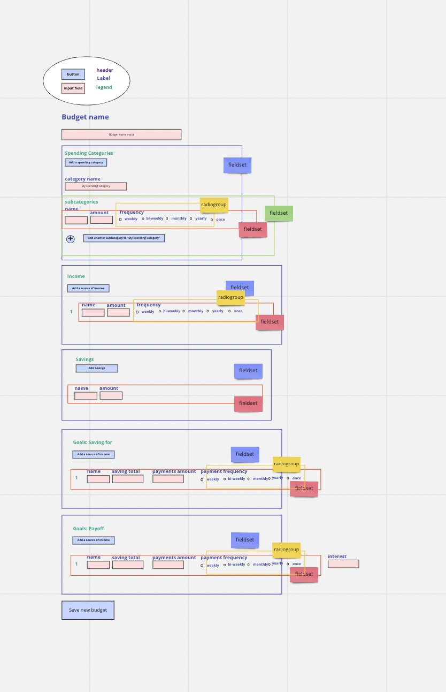
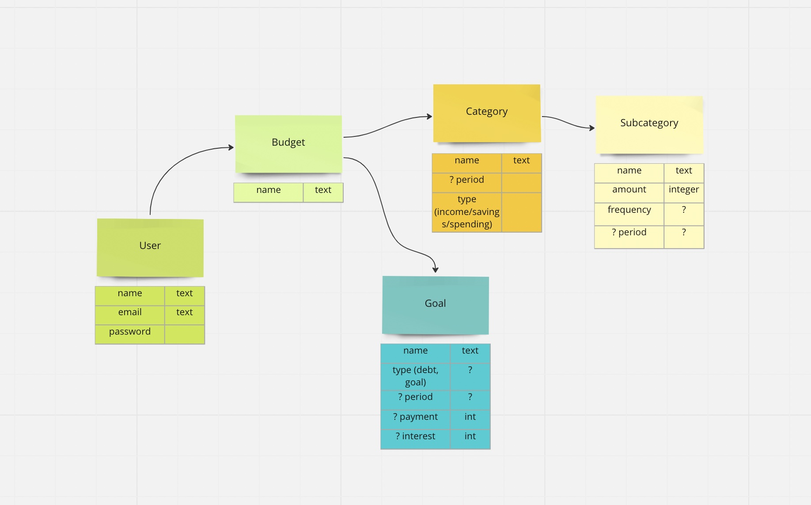

# Budget App

## Frontend

### Form flow 
#### Create budget 

```
budget {
    name
    description
    income { // stored as category
        subcategory {
            name
            amount
            frequency
            period
        }
    } 
    savings { // stored as category
        subcategory {
            name
            amount
        }
    }
    spending {
        category {
            name
            subcategory {
                name
                amount
                frequency 
                period
            }
        }
    }

    goals {
        goal {
            name
            type (payoff, save up)
            payment {
                frequency
                amount
            }
            interest
        }
    }
}
```

### Pages - HTML
#### Log in page
```html
<header>
    ?
<main>
    <h1> [app name]
    <h2> 'sign in'
        <form>
    <h2> 'sign up'
        <form>
<footer>
    ?
```
#### Header (signed in)
```
header 
    home link
    sign out
```

#### User Home
```
main 
    h1
        h2 budgets
            li existing budgets
        h2 create new budget 
            button
            form 
                budget name
```
#### Create Budget
```
    h1
        form
            "About this budget": fieldset/ legend
                "Name this budget": label/input type="text"
                "Notes about this budget": label/input type="textarea"
             "Income": fieldset/ legend
                    "Add a source of income": button
                    "Income source [#]": fieldset/ legend
                        "name": label/ input type=text
                        "amount": label/input type=int
                        "frequency": label/ group role=radiogroup?
                                "weekly": label/ button type="radio"
                                "bi-weekly": label/ button type="radio"
                                "monthly ": label/ button type="radio"
                                "yearly": label/ button type="radio"
            "Savings": fieldset/ legend
                "Add a Savings Category": button
                "Saving Category [#]": fieldset/ legend
                        "name": label/ input type=text
                        "amount": label/input type=int
            "Spending": fieldset/ legend
                "Add a spending Category": button
                    "Spending Category [#]": fieldset/ legend
                        "Name this spending category": label/ input type="text"
                        "Add a subcategory": button
                            "Spending Subcategory": fieldset/ legend
                                "Name this subcategory": label/input type="text"


                
            


                            


#### Budget 
```
    "h1 Budget": [Budget name]
        h2 
```
## Backend
### Tables


